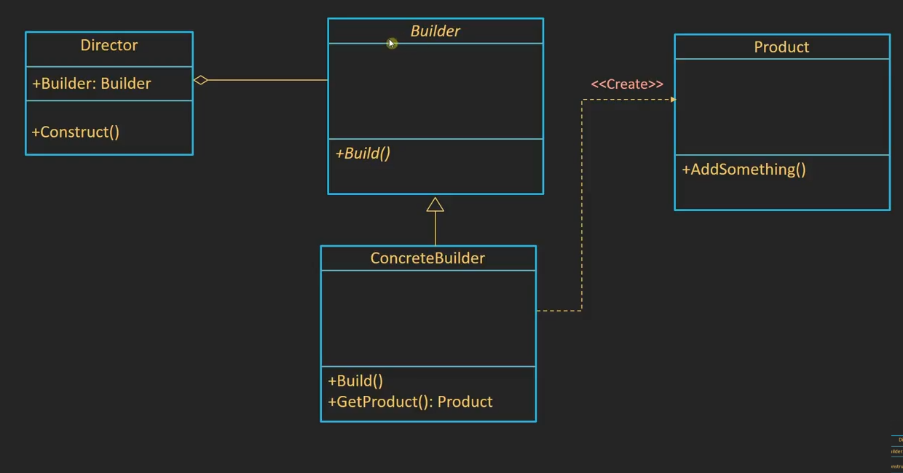

# Builder Design Pattern

## Overview

The **Builder Design Pattern** is a creation design pattern that provides a way to construct a complex object step by step. It separates the construction of a complex object from its representation, allowing the same construction process to create different representations. This pattern is particularly useful when an object has a large number of parameters, and it becomes difficult to manage constructors with a significant number of parameters.

## Intent

The intent of the Builder pattern is to:

- Separate the construction of a complex object from its representation so that the same construction process can create different representations.
- Construct an object step by step, allowing finer control over the construction process.
## Class Diagram

## Participants

1. **Builder:** An interface or an abstract class that defines the construction steps for creating the product.
   
2. **ConcreteBuilder:** Implements the Builder interface and provides specific implementations for constructing the product (car, motorcycle).

3. **Director:** Manages the construction process using the Builder.

4. **Product:** The complex object that is being constructed.

